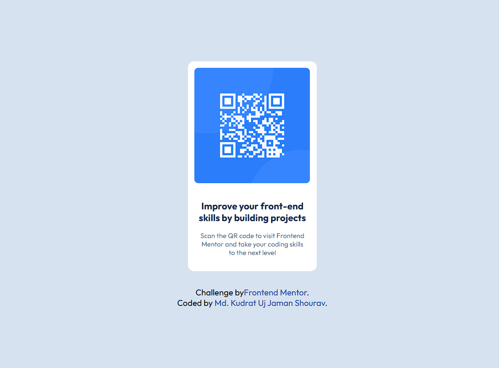

# Frontend Mentor - QR code component solution

This is a solution to the [QR code component challenge on Frontend Mentor](https://www.frontendmentor.io/challenges/qr-code-component-iux_sIO_H). Frontend Mentor challenges help you improve your coding skills by building realistic projects. 

## Table of contents

- [Overview](#overview)
  - [Screenshot](#screenshot)
  - [Links](#links)
- [My process](#my-process)
  - [Built with](#built-with)
  - [What I learned](#what-i-learned)
  - [AI Collaboration](#ai-collaboration)
- [Author](#author)


## Overview

### Screenshot




### Links

- Solution URL: [Add solution URL here](https://www.frontendmentor.io/solutions/qr-code-component-DOXfEeKPy4)
- Live Site URL: [Add live site URL here](https://project-qr-code-component.netlify.app/)

## My process

### Built with

- Semantic HTML5 markup
- CSS custom properties
- Flexbox

### What I learned

This project helped me understand how Flexbox can center elements both horizontally and vertically.

```css
.proud-of-this-css {
      height:100vh;
      display: flex;
      flex-direction: column;
      justify-content: center;
      align-items: center;
}
```

### AI Collaboration

- ChatGPT
- debugging
- learned how to think when i face any problem

## Author

- Frontend Mentor - [@shouravjaman](https://www.frontendmentor.io/profile/yourusername)


